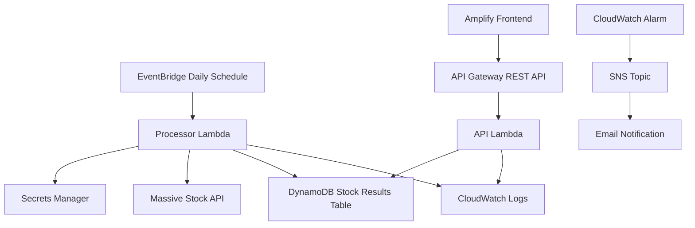

# Pennymac Stock Mover Serverless Pipeline


A serverless AWS application that tracks a watchlist of major tech stocks, identifies the single largest daily mover by absolute percentage change, stores the result, exposes it through an API, and displays the historical winners on a frontend dashboard.

## Project Goal

The TRE team needs a daily dashboard that watches the following stocks:

```text
AAPL, MSFT, GOOGL, AMZN, TSLA, NVDA
```

Each day, the system determines which stock had the largest absolute percentage movement from open to close.

Example:

```text
AAPL: +1.2%
TSLA: -4.1%
NVDA: +2.7%

Winner: TSLA because |-4.1| is the largest move
```

## Architecture



## AWS Services Used

```text
AWS Lambda          - Runs processor and API logic
Amazon DynamoDB     - Stores daily stock mover results
Amazon EventBridge  - Triggers the processor Lambda daily
Amazon API Gateway  - Exposes GET /movers endpoint
AWS Amplify         - Hosts the frontend dashboard
AWS Secrets Manager - Stores the Massive API key securely
Amazon CloudWatch   - Logs and monitors Lambda execution
Amazon SNS          - Sends email alerts from CloudWatch alarms
Terraform           - Defines and deploys infrastructure as code
GitHub Actions      - Runs CI validation and tests
```

## API Endpoint

```http
GET /movers
```

Example response:

```json
[
  {
    "trade_date": "2026-06-10",
    "ticker": "NVDA",
    "close": "145.22",
    "percent_change": "3.42"
  },
  {
    "trade_date": "2026-06-09",
    "ticker": "TSLA",
    "close": "182.10",
    "percent_change": "-2.15"
  }
]
```

## Frontend

The frontend is a static dashboard hosted with AWS Amplify.

It displays:

```text
Latest winning ticker
Latest percentage move
Latest closing price
7-day bar chart
7-day results table
```

The frontend calls the API Gateway endpoint directly from `frontend/app.js`.

## Backend Logic

The processor Lambda:

```text
1. Reads the watchlist
2. Retrieves the Massive API key from Secrets Manager
3. Calls the Massive API for each ticker
4. Calculates percent change from open to close
5. Selects the stock with the largest absolute percent change
6. Writes the daily winner to DynamoDB
```

Percent change formula:

```text
percent_change = ((close - open) / open) * 100
```

The API Lambda:

```text
1. Reads stock mover records from DynamoDB
2. Sorts results by trade date
3. Returns the most recent 7 records
4. Enables CORS for frontend access
```

## Repository Structure

```text
PennyMac/
├── .github/
│   └── workflows/
│       └── ci.yml
├── frontend/
│   ├── index.html
│   ├── app.js
│   └── style.css
├── lambda/
│   ├── handler.py
│   ├── api_handler.py
│   └── requirements.txt
├── terraform/
│   ├── main.tf
│   ├── variables.tf
│   ├── outputs.tf
│   ├── dynamodb.tf
│   ├── iam.tf
│   ├── lambda.tf
│   ├── eventbridge.tf
│   ├── apigateway.tf
│   ├── amplify.tf
│   ├── secrets.tf
│   ├── cloudwatch.tf
│   └── dev.tfvars.example
├── tests/
│   └── test_handler_local.py
├── .gitignore
└── README.md
```

## Infrastructure as Code

All AWS infrastructure is defined with Terraform.

Deploy:

```powershell
cd terraform
terraform init
terraform fmt
terraform validate
terraform plan -var-file="dev.tfvars"
terraform apply -var-file="dev.tfvars"
```

Destroy:

```powershell
terraform destroy -var-file="dev.tfvars"
```

## Required Terraform Variables

Create a local file:

```text
terraform/dev.tfvars
```

Example:

```hcl
project_name        = "pennymac-stock-pipeline"
aws_region          = "us-east-1"
environment         = "dev"
massive_api_key     = "your_massive_api_key_here"
github_access_token = "your_github_token_here"
alert_email         = "your_email_here@example.com"
```

Important:

```text
dev.tfvars should never be committed.
```

## Security

Secrets are not hardcoded in Lambda source code.

The Massive API key is stored in AWS Secrets Manager and accessed by the processor Lambda at runtime.

```text
Terraform variable
      ↓
Secrets Manager secret
      ↓
Lambda IAM permission
      ↓
Processor Lambda runtime access
```

Sensitive local files are ignored by Git:

```gitignore
.env
terraform/dev.tfvars
terraform/*.tfstate
terraform/*.tfstate.*
terraform/.terraform/
```

## Monitoring and Alerts

CloudWatch monitors Lambda execution.

A CloudWatch alarm watches the processor Lambda error metric:

```text
AWS/Lambda Errors > 0
```

If the processor Lambda fails:

```text
CloudWatch Alarm
      ↓
SNS Topic
      ↓
Email Notification
```

This prevents silent pipeline failures.

## CI/CD

GitHub Actions validates the project on every push.

The workflow runs:

```text
Terraform formatting check
Terraform validation
Python dependency installation
Pytest unit tests
```

This helps ensure infrastructure and backend code do not break before deployment.

## Local Frontend Preview

```powershell
cd frontend
python -m http.server 5173
```

Then open:

```text
http://localhost:5173
```

## Testing

Run Python tests:

```powershell
pip install -r lambda/requirements.txt
pip install pytest
pytest
```

## Design Decisions

### Why Lambda?

Lambda is a good fit because the workload is small, scheduled, and event-driven. There is no need to run a permanent server.

### Why DynamoDB?

DynamoDB works well because the application stores simple daily records and reads a small recent history. It avoids unnecessary relational database overhead.

### Why EventBridge?

EventBridge provides a clean scheduled trigger for the daily processor Lambda without needing a custom polling service.

### Why API Gateway?

API Gateway exposes the Lambda-backed `/movers` endpoint as a public REST API for the frontend.

### Why Secrets Manager?

Secrets Manager keeps the Massive API key out of source code and Lambda environment plaintext.

### Why CloudWatch and SNS?

CloudWatch provides operational visibility, and SNS sends email notifications when the scheduled pipeline fails.

## Trade-Offs

This project prioritizes simplicity, low cost, and serverless architecture.

Current trade-offs:

```text
DynamoDB scan is acceptable because the dataset is very small
Frontend calls API Gateway directly
Only the main processor Lambda has an error alarm
Remote Terraform state is not required for a single-developer demo
```

Future improvements:

```text
Add API Gateway 5XX alarms
Add Lambda duration and throttle alarms
Add authentication for private dashboard access
Add more detailed retry/backoff logic for stock API failures
```